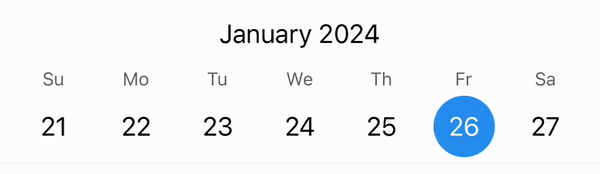
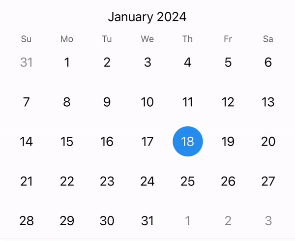
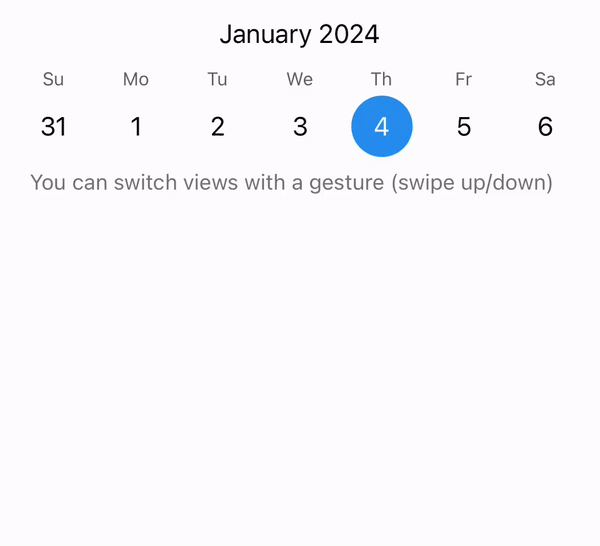

[LICENSE]: https://github.com/sssajjad007/react-native-jalali-calendars/blob/HEAD/LICENSE
[AUTHOR]: https://github.com/rozhkovs
[REANIMATED-GITHUB]: https://github.com/software-mansion/react-native-reanimated/
[GH-GITHUB]: https://github.com/software-mansion/react-native-gesture-handler
[DAYJS-GITHUB]: https://github.com/iamkun/dayjs
[DAYJS-LOCALE]: https://day.js.org/docs/en/i18n/instance-locale

# 📅 React Native Jalali Calendars 🗓️

A declarative cross-platform React Native calendar component for iOS, Android and Web.

<table>
  <tr>
    <td align="center">
      
      <br />
      WeekCalendar
    </td>
  </tr>
</table>
<table>
  <tr>
    <td align="center">
      
      <br />
      MonthCalendar
    </td>
    <td align="center">
      
      <br />
      WMCalendar
    </td>
  </tr>
</table>


## Installation
```shell
yarn add @sssajjad007/react-native-jalali-calendars
```

Also, you need to install following dependencies, if you already have them you can pass this step

```shell
yarn add dayjs react-native-gesture-handler react-native-reanimated
```
For [react-native-gesture-handler][GH-GITHUB] and [react-native-reanimated][REANIMATED-GITHUB]
additional steps may be required: see their documentations

## Navigation

- [Usage](#Usage)
- [Localization](#Usage)
- [Customization](#Customization)
- [Marked days](#Marked-days)
- [API](#API)
  - [Common](#Common)
  - [WeekCalendar](#WeekCalendar)
  - [MonthCalendar](#MonthCalendar)
  - [WMCalendar](#WMCalendar)


## Usage

If you want to see more examples and experiment, run the examples locally.

```shell
git clone git@github.com:sssajjad007/react-native-jalali-calendars.git
cd react-native-jalali-calendars
yarn install
cd example && yarn install && yarn ios
```

### Base case
```jsx
import React, {useState} from 'react';
import {MonthCalendar} from '@sssajjad007/react-native-jalali-calendars';

const App = () => {
  const [selected, setSelected] = useState(null);

  return (
    <MonthCalendar
      selectedDay={selected}
      onDayChanged={({day}) => {
        setSelected(day);
      }}
    />
  );
};

export default App;
```

### Multiple selection
If you needed a more complex date selection behavior, you can do the following:

```jsx
const App = () => {
  const [days, setDays] = useState([]);

  return (
    <MonthCalendar
      selectedDay={null} // Important! This will disable the internal date selection state
      markedDays={days.map(day => [day, {selected: true}])}
      onDayPress={({day}) => {
        setDays(prev => {
          if (prev.includes(day)) {
            return prev.filter(p => p !== day);
          } else {
            return [...prev, day];
          }
        });
      }}
    />
  );
};
```

## Localization

[dayjs][DAYJS-GITHUB] works under the hood of calendars and all localization settings are taken from it.

For example, let's set the French localization:

```jsx
import React, {useState} from 'react';
import {MonthCalendar} from '@sssajjad007/react-native-jalali-calendars';
import 'dayjs/locale/fr' // import the French localization

const App = () => {
  return (<MonthCalendar locale={'fr'}/>);
};

export default App;
```

You also can set your own settings:

```jsx
<MonthCalendar
  locale={{
    weekStart: 0,
    months: [/* list of month names */],
    weekdaysMin: [/* list of weekdays */],
    ...
  }}
/>
```

You can learn more about the localization at [dayjs][DAYJS-LOCALE]

## Customization
### Theme

Theme settings allows you to easily change display of calendars: element sizes, paddings and even animations

```jsx
<MonthCalendar
  theme={{
    calendarPaddingHorizontal: 16,
    monthTitleColor: '#000000',
    monthTitleFontSize: 17,
    weekDayTitleColor: '#707070',
    weekDayTitleFontSize: 12,
    pagePaddingTop: 4,
    pagePaddingBottom: 4,
    pageBetweenRows: 2,
    dayContainerSize: 40,
    dayFontSize: 17,
    dayBgColor: {value: 'transparent', type: 'timing', option: {duration: 50}},
    daySelectedBgColor: {value: '#2C98F0', type: 'timing', option: {duration: 50}},
    dayColor: {value: '#000000', type: 'timing', option: {duration: 50}},
    daySelectedColor: {value: '#ffffff', type: 'timing', option: {duration: 50}},
    daySecondaryOpacity: 0.4,
    dayDisabledOpacity: 0.4,
    dayDotSize: 5,
  }}
/>
```

### Styles

Sometimes the theme configuration may not be enough. When you can use the styles:

```jsx
<MonthCalendar
  containerStyle={{/* ... */}}
  monthRowStyle={{/* ... */}}
  monthTitleStyle={{/* ... */}}
  weekDayRowStyle={{/* ... */}}
  weekDayContainerStyle={{/* ... */}}
  weekDayTitleStyle={{/* ... */}}
  pageContainerStyle={{/* ... */}}
  dayRowStyle={{/* ... */}}
  dayContainerStyle={{/* ... */}}
  dayTextStyle={{/* ... */}}
  dayDotRowStyle={{/* ... */}}
  dayDotStyle={{/* ... */}}
/>
```

Some style properties may accept selectors that allow you to fine-tune styles

```jsx
<MonthCalendar
  dayContainerStyle={({
    day,
    isSelected,
    isToday,
    isDisabled,
    isSecondary,
  }) => {
    return {/* ... */}
  }}
/>
```

It is also possible to render your own components.

## Marked days

You can set a set of dates to be selected, disabled, or marked with dots

Let's look as a simple example:

```jsx
<MonthCalendar
  markedDays={[
    ['2023-01-01', {selected: true}], // one day
    ['2023-01-01', '2023-01-14', {dots: [{color: 'red'}]}], // range from '2023-01-01' to '2023-01-14'
  ]}
/>
```

The date '2023-01-01' will contain the selected flag and a red dot.
The following records add or override data.
If the dates with dots intersect, then the dots will be merged into a new list.
You can set a key for dots that will allow you to distinguish and override these dots.

### Selector
There is support for a selector that is called when new dates appear


```jsx
<MonthCalendar
  markedDays={({start, end}) => {
    return [[start, end, {dots: [{color: 'orange'}]}]]
  }}
/>
```

You can also pass a list and a selector together.

```jsx
<MonthCalendar
  markedDays={{
    list: [/* records */],
    selector: (info) => [/* records */]
  }}
/>
```

## API

### Common
- [Base calendar props](#Base-calendar-props)
- [useTheme](#useTheme)
- [useDots](#useDots)

#### Base calendar props
- ```ref?``` [{scrollToToday: function} | undefined] - calendar ref.
- ```locale?``` [string | object | undefined] - localization. More details can be found in the [Localization](#Localization)
- ```theme?``` [object | undefined] - theme. More details can be found in the [Theme](#Theme)
- ```selectedDay?``` [string | null | undefined] - selected date. If nothing is specified or undefined is passed, the calendar will use its internal state. Pass null to disable it
- ```onDayChanged?``` [function | undefined] - called when the date is selected.
- ```onDayPress?``` [function | undefined] - called when the date is pressed.
- ```dayMin?``` [string | undefined] - before this date, all days will be disabled
- ```dayMax?``` [string | undefined] - after this date, all days will be disabled
- ```markedDays?``` [object | array | function | undefined] - marked dates. More details can be found in the [Marked days](#Marked-days)
- ```calendarWidth?``` [number | undefined] - calendar width. It is recommended to set it for instant display during primary rendering
- ```visibleMonthHeader?``` [boolean | undefined] (default=true) - flag for displaying the month row in the header.
- ```visibleWeekDaysHeader?``` [boolean | undefined] (default=true) - flag for displaying the days of week in the header.
- ```onMonthInitialized?``` [function | undefined] - called when the month is initialized.
- ```onMonthChanged?``` [function | undefined] - called when the month is changed.
- ```onPageMounted?``` [function | undefined] - called when the page is mounted.
- ```onPageUnmounted?``` [function | undefined] - called when the page is unmounted.
- ```renderDay?``` [function | undefined] - rendering your own day component.
- ```renderMonthHeaderTitle?``` [function | undefined] - rendering your own header title component.
- ```containerStyle?``` [array | object | undefined] - the style for the calendar container.
- ```monthRowStyle?``` [array | object | undefined] - the style for the month row in the header.
- ```monthTitleStyle?``` [array | object | undefined] - the style for the month title in the header.
- ```weekDayRowStyle?``` [array | object | undefined] - the style for the days of week row in the header.
- ```weekDayContainerStyle?``` [array | object | undefined] - the style for the day of week container in the header.
- ```weekDayTitleStyle?``` [array | object | undefined] - the style for the day of week title in the header.
- ```pageContainerStyle?``` [array | object | undefined] - the style for the page container.
- ```dayRowStyle?``` [array | object | undefined] - the style for the day row.
- ```dayContainerStyle?``` [array | object | undefined] - the style for the day container.
- ```dayTextStyle?``` [array | object | undefined] - the style for the day text.
- ```dayDotRowStyle?``` [array | object | undefined] - the style for the day dot row container.
- ```dayDotStyle?``` [array | object | undefined] - the style for the day dot text.

#### useTheme
The hook provides a calendar theme. It can be used in components that are nested in the calendar.
More details can be found in the [Theme](#Theme)

#### useDots
The hook provides set of dots for a specific day.
It can only be used inside the component that is returned from the renderDay method.


### WeekCalendar
The calendar displays weekly pages.

#### Props
- ```onPageIndexChanged?``` [function | undefined] - called when the page index is changed.
- ```pageHeight?``` [number | function | undefined] (default = the height is calculated for 6 lines of a given theme setting) - page height.
- ```initPageIndex?``` [string | object | undefined] (default = today) - initializes on the specified page.
- ```pageStart?``` [string | object | undefined] (default = today - 5 year) - the starting point of the pages in the calendar.
- ```pageEnd?``` [string | object | undefined] (default = today + 5 year) - the ending point of the pages in the calendar.

### MonthCalendar
The calendar displays monthly pages.

#### Props
- ```onPageIndexChanged?``` [function | undefined] - called when the page index is changed.
- ```pageHeight?``` [number | function | undefined] - page height.
- ```initPageIndex?``` [string | object | undefined] (default = today) - initializes on the specified page.
- ```pageStart?``` [string | object | undefined] (default = today - 5 year) - the starting point of the pages in the calendar.
- ```pageEnd?``` [string | object | undefined] (default = today + 5 year) - the ending point of the pages in the calendar.

### WMCalendar
The calendar displays weekly or monthly pages.

#### Props
- ```onPageIndexChanged?``` [function | undefined] - called when the page index is changed.
- ```pageHeight?``` [number | function | undefined] - page height
- ```initPageIndex?``` [string | object | undefined] (default = today) - initializes on the specified page.
- ```pageStart?``` [string | object | undefined] (default = today - 5 year) - the starting point of the pages in the calendar.
- ```pageEnd?``` [string | object | undefined] (default = today + 5 year) - the ending point of the pages in the calendar.
- ```type?``` ['week' | 'month' | undefined] (default = 'week') - calendar view type.
- ```onTypeChanged?``` [function | undefined] - called when the view type is changed.
- ```enableSwitchGesture?``` [boolean | undefined] (default=true) - the ability to switch the calendar type with a gesture
- ```switchAnimConfig?``` [object | undefined] - configuration of the animation when switching the calendar.
- ```monthPagerOffsetY?``` [function | undefined] - calculation of the offset of the month view page relative to the week page.

#### withWMSwitching
HOC includes a scrolling component, which in the future is a way to switch the calendar mode using gestures.


## 🎯 Was it helpful?
Do you like it and find it helpful? You can help this project in the following way:
- ⭐ Put the star.
- 💡 Suggest your ideas.
- 😉 Open a founded issue.

## 🤝 Contributing
See the [contributing guide](CONTRIBUTING.md) to learn how to contribute to the repository and the development workflow.

## 📄 License
sssajjad007 React Native Jalali Calendars is MIT licensed, as found in the [LICENSE] file.

---

Made with [create-react-native-library](https://github.com/callstack/react-native-builder-bob)
